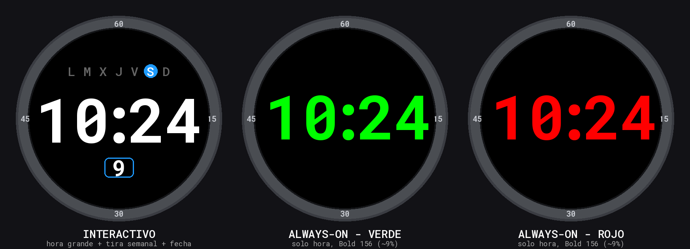

# Epix Digital — Esfera de reloj para Garmin Epix Pro 51 mm (Gen 2)

Esfera **digital moderna y minimalista** para el **Garmin Epix Pro 51 mm (Gen 2)**
(pantalla AMOLED redonda de 454 × 454 px, ID de dispositivo `epix2pro51mm`).

Diseñada para **máxima legibilidad**, con fuentes **Roboto Mono** (open source,
Apache 2.0) y **Always-On Display** seguro contra *burn-in*.



## Diseño

La esfera tiene **dos presentaciones** que cambian solas:

### Modo INTERACTIVO (cuando miras el reloj)

- **Fondo negro** con máximo contraste.
- **Hora `HH:MM`** en **Roboto Mono Bold 156**, muy grande y blanca (mismo
  tamaño que las esferas de fábrica).
- **Día de la semana gráfico**: una **tira de 7 puntos** (`L M X J V S D`,
  lunes primero) con el día de hoy resaltado en un círculo de acento. Se lee
  de un vistazo por posición y color, sin depender de números pequeños.
- **Día del mes** en un **número grande dentro de un recuadro** ("ventana de
  fecha"), legible sin gafas.
- **Sin segundos.**

### Modo ALWAYS-ON (reposo, pantalla siempre encendida)

- **Solo la hora `HH:MM`**, lo más grande y legible posible: **Roboto Mono
  Bold 156**, dibujada en tres bloques (`HH` · `:` · `MM`) con el `:` ceñido
  para maximizar el tamaño de los dígitos sin salirse de la pantalla.
- **Color vivo AMOLED**: Verde (por defecto), Rojo o Blanco.
- **~9,2 % de píxeles encendidos** — apurando el límite del 10 % que exige
  Garmin en AOD, pero con margen de seguridad (verificado).
- **Sin fecha, segundos ni rellenos.**
- **Desplazamiento de píxeles cada minuto** (± 8 px) para evitar el quemado
  del panel AMOLED (*burn-in protection*).

### Personalizable desde Garmin Connect

- **Formato 24 horas** (activado por defecto).
- **Color de acento (interactivo)**: Azul (def.), Rojo, Verde, Naranja o Blanco.
- **Color de la hora en Always-On**: Verde (def.), Rojo o Blanco.

## ⚠️ Sobre la sensibilidad del gesto de muñeca / brillo

Es la única petición que **no se puede resolver por software** en una esfera:
la detección del gesto de levantar la muñeca y el control de la
retroiluminación los gestiona el **firmware del reloj**, y Connect IQ **no
expone ninguna API** para que una watch face los haga más sensibles ni fuerce
el brillo (está bloqueado a propósito). Lo que sí hace esta esfera es
**repintar al instante** el diseño brillante al despertar (`onExitSleep`).

Para afinar la respuesta al gesto, en el **propio reloj**:

- **Configuración → Sistema → Retroiluminación → Gesto:** *Activado*.
- Sube el **Brillo** y alarga el **Tiempo de espera**.
- Con **Always-On Display activado**, la hora se ve siempre sin necesidad del
  gesto (por eso hemos cuidado tanto ese modo).

## Estructura del proyecto

```
.
├── manifest.xml                     # Dispositivo objetivo y metadatos
├── monkey.jungle                    # Configuración de build
├── source/
│   ├── EpixWatchFaceApp.mc          # Clase de la aplicación
│   └── EpixWatchFaceView.mc         # Dibujado (interactivo + AOD)
├── resources/
│   ├── drawables/                   # Icono de lanzador
│   ├── fonts/                       # Roboto Mono rasterizada (BMFont .fnt+.png)
│   ├── strings/                     # Textos (inglés + fallback)
│   └── settings/                    # Ajustes del usuario
├── resources-spa/
│   └── strings/                     # Textos en español (días/meses)
├── fonts-src/                       # TTF originales + generador + licencia
└── preview/                         # Imagen de vista previa + generador
```

## Fuentes (Roboto Mono)

Connect IQ no consume TTF directamente: usa fuentes **BMFont** (`.fnt` + `.png`).
Los `.ttf` originales están en `fonts-src/` y se rasterizan con
`fonts-src/gen_fonts.py` (requiere `Pillow`). Para regenerarlas:

```bash
python3 fonts-src/gen_fonts.py
```

Roboto Mono © The Roboto Mono Project Authors, licencia Apache 2.0
(ver `fonts-src/LICENSE.txt`).

## Cómo compilarla y cargarla en tu reloj

Para generar el archivo instalable necesitas el **Connect IQ SDK** de Garmin
(gratuito). Yo he dejado todo el código listo; estos son los pasos en tu PC:

### 1. Instala las herramientas

1. Descarga el **Connect IQ SDK Manager**:
   https://developer.garmin.com/connect-iq/sdk/
2. Con el SDK Manager, instala el **SDK más reciente** y el **device Epix Pro
   51 mm (Gen 2)**.
3. Instala **Visual Studio Code** y la extensión oficial **Monkey C**
   (Garmin) — es lo más cómodo.

### 2. Genera tu clave de desarrollador (solo la primera vez)

Necesaria para firmar la app. En una terminal:

```bash
openssl genrsa -out developer_key.pem 4096
openssl pkcs8 -topk8 -inform PEM -outform DER -in developer_key.pem \
    -out developer_key.der -nocrypt
```

Guarda `developer_key.der` en un lugar seguro (está en `.gitignore` para no
subirla nunca al repositorio).

### 3. Compila (genera el `.prg`)

Desde la raíz del repositorio:

```bash
monkeyc \
  -o bin/EpixDigital.prg \
  -f monkey.jungle \
  -y /ruta/a/developer_key.der \
  -d epix2pro51mm
```

> En VS Code: pulsa **F5** (con el device Epix Pro 51 mm seleccionado) para
> compilarla y abrirla directamente en el **simulador**.

### 4. Cárgala en el reloj

**Opción A — Sideload por USB (rápido para probar):**

1. Conecta el Epix Pro al PC por USB.
2. Copia `bin/EpixDigital.prg` a la carpeta `GARMIN/APPS/` del reloj.
3. Desconecta. La esfera aparecerá en la lista de esferas del reloj.

**Opción B — Vía Connect IQ Store (para tenerla “oficial”):**

1. Crea un `.iq` con `monkeyc` (o **Build → Export Wizard** en VS Code).
2. Súbela a tu cuenta de desarrollador en https://apps.garmin.com/ y luego
   instálala desde la app **Connect IQ** en el móvil.

### 5. Actívala

En el reloj: mantén pulsado el botón central → **Esfera del reloj** (Watch
Face) → elige **Epix Digital**. Los ajustes (24 h / color) se cambian desde
**Garmin Connect → tu reloj → Connect IQ → Epix Digital → Configuración**.

## Notas técnicas

- `onPartialUpdate` refresca los segundos una vez por segundo solo con la
  pantalla activa; en reposo se hace un único refresco por minuto y se ocultan
  los segundos (menos píxeles encendidos = menos consumo y menos riesgo de
  *burn-in* en AMOLED).
- No requiere permisos: solo usa hora, fecha del sistema.
- `minApiLevel` 3.3.0 para asegurar compatibilidad con el Epix Pro Gen 2.
